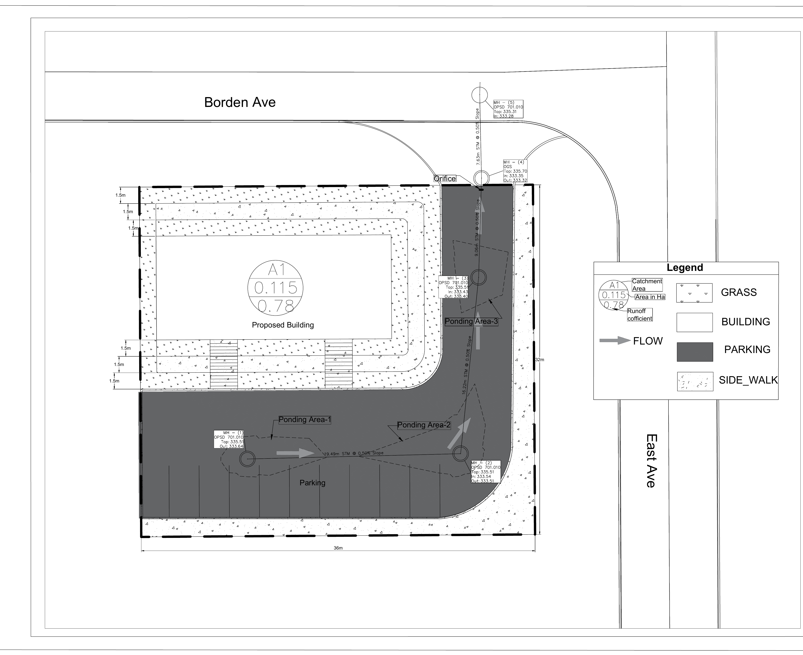
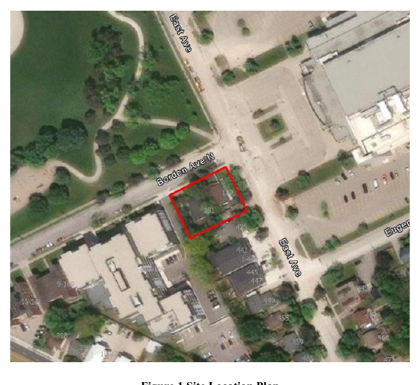
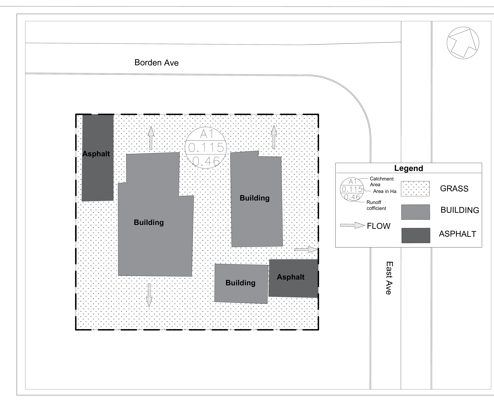
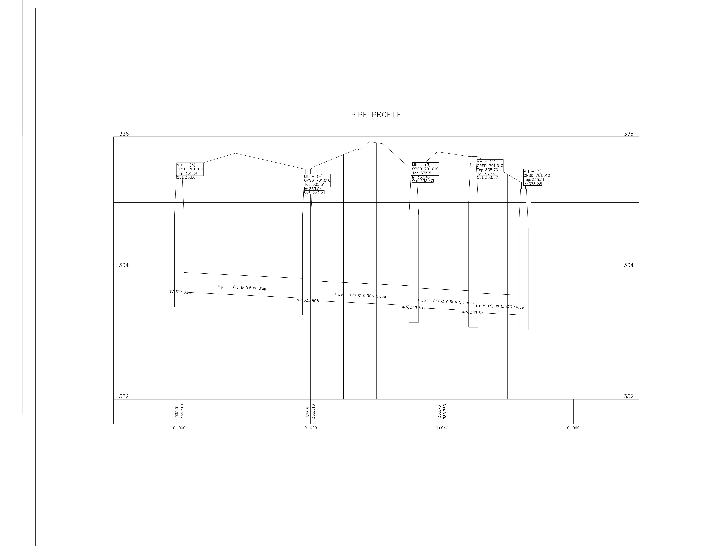

# 187 Borden Avenue North - Conceptual Functional Servicing & Stormwater Management

**Self-directed civil engineering portfolio project | Kitchener, Ontario | August 2026**

> **Portfolio disclaimer:** This project was prepared for technical portfolio demonstration only. It is a conceptual design and is not intended for municipal approval, tender, construction, or professional engineering reliance.



## Project Overview

This project develops a conceptual functional servicing and stormwater management strategy for a proposed redevelopment at **187 Borden Avenue North, Kitchener, Ontario**. The approximately **0.115 ha** site was assessed for grading, drainage, stormwater quantity control, conceptual quality treatment, minor storm servicing, and major overland drainage.

The proposed development consists of **three-storey stacked townhouse units**, a vehicular access from Borden Avenue North, on-site parking, and associated site servicing and drainage infrastructure.

## Engineering Scope

- Existing and proposed drainage assessment
- Civil 3D existing- and finished-grade surface development
- Feature-line grading, drainage divides, ridge/valley control, and ponding review
- Catchbasin and storm sewer network layout
- Storm sewer plan/profile development
- Rational Method peak-flow calculations
- Modified Rational Method detention-storage assessment
- Conceptual outlet-control/orifice evaluation
- Surface ponding, pipe, and drainage-structure storage assessment
- Conceptual oil-grit separator (OGS) quality-treatment strategy
- Minor storm sewer and major overland drainage coordination

## Software & Tools

- **Autodesk Civil 3D 2027** - surfaces, feature lines, grading, pipe networks, profiles, labels, and drainage review
- **ArcGIS Pro** - site-location mapping and geographic context
- **Microsoft Excel** - runoff, IDF, orifice, and storage calculations

## Conceptual Design Criteria

| Design Item | Portfolio Criterion |
|---|---|
| Quantity control | Control post-development 100-year runoff to the pre-development 5-year peak discharge |
| Hydrology | Rational Method for peak flow; Modified Rational Method for conceptual storage |
| Time of concentration | 10 minutes |
| Surface storage | Controlled shallow ponding, approximately 0.20 m maximum depth |
| Quality control | OGS or equivalent approved treatment upstream of the municipal storm connection |
| Drainage | Coordinated minor storm sewer and major overland drainage systems |

**Quantity-control objective:** `Qpost,100-year <= Qpre,5-year`

## Key Design Results

| Parameter | Result |
|---|---:|
| Site area | 0.115 ha |
| Pre-development weighted runoff coefficient | 0.46 |
| Post-development weighted runoff coefficient | 0.78 |
| Pre-development 5-year peak flow | 16.28 L/s |
| Uncontrolled post-development 100-year peak flow | 49.14 L/s |
| 60 mm theoretical trial-orifice discharge | 15.35 L/s |
| Preliminary required storage | 25.16 m3 |
| Surface ponding storage | 17.84 m3 |
| Storm sewer pipe storage | 3.17 m3 |
| Drainage-structure storage | 7.03 m3 |
| Total available storage | 28.02 m3 |
| Preliminary storage surplus | 2.86 m3 |

### Outlet-Control Design Finding

A **60 mm theoretical trial opening** produces a discharge of approximately **15.35 L/s**, which is below the 16.28 L/s allowable release used in the portfolio calculation. However, the report notes a **75 mm minimum orifice criterion**. Under the assumed head, a 75 mm opening would discharge approximately **23.96 L/s**, exceeding the allowable release. Therefore, the outlet-control arrangement is **not presented as a finalized design** and would require further detailed-design iteration.

This is an important engineering outcome of the exercise: storage availability alone does not finalize the stormwater management design; outlet-control geometry, minimum opening constraints, hydraulic head, maintenance, and municipal/agency requirements must be reconciled together.

## Design Workflow

```text
Existing Conditions / Base Mapping
             |
             v
Civil 3D Existing Surface + Site Geometry
             |
             v
Proposed Grading / Finished-Grade Surface
             |
             v
Drainage Areas + Catchbasins + Overland Routes
             |
             v
Rational Method Peak-Flow Assessment
             |
             v
Storm Sewer Network + Profile
             |
             v
Modified Rational Method Storage Assessment
             |
             v
Surface + Pipe + Structure Storage
             |
             v
Outlet-Control Evaluation
             |
             v
Conceptual OGS Quality Treatment
             |
             v
Municipal Storm Sewer Connection
```

## Drawing Gallery

### Site Location



### Pre-Development Drainage Plan



### Post-Development Drainage & Stormwater Management Plan


### Storm Sewer Profile



## Repository Files

### Report

- [Conceptual Functional Servicing & Stormwater Management Report](docs/187_Borden_Conceptual_FSR_SWM_Report.pdf)
- [Design Basis & Methodology](docs/Design_Basis_and_Methodology.md)

### Drawings

- [Pre-Development Drainage Plan](drawings/01_Pre_Development_Drainage_Plan.pdf)
- [Post-Development Drainage & Stormwater Management Plan](drawings/02_Post_Development_Drainage_SWM_Plan.pdf)
- [Storm Sewer Profile](drawings/03_Storm_Sewer_Profile.pdf)

### Calculations

- [Design Calculation Workbook](calculations/187_Borden_Design_Calculations.xlsx)
- [Calculation Summary](calculations/Calculation_Summary.md)
- [Key Design Metrics CSV](calculations/key_design_metrics.csv)

## Civil 3D Skills Demonstrated

- Existing- and proposed-surface creation
- Feature lines and breaklines
- Grading and tie-ins
- Surface drainage review using Water Drop analysis
- User-defined contour review for localized ponding
- Pipe-network creation and editing
- Catchbasin/manhole and pipe labeling
- Pipe invert and slope coordination
- Plan/profile production
- Storm sewer profile development
- Drawing-sheet production

## Stormwater Engineering Skills Demonstrated

- Composite runoff coefficient calculation
- IDF-based rainfall-intensity calculation
- Rational Method peak-flow analysis
- Pre- vs. post-development comparison
- Quantity-control target development
- Orifice-equation application
- Modified Rational Method storage analysis
- Surface ponding storage assessment
- Pipe and drainage-structure storage assessment
- Minor/major drainage-system coordination
- Conceptual stormwater quality treatment using an OGS

## Limitations & Next Steps

This project is intentionally conceptual. Detailed design would require, at minimum:

- Field/topographic survey and legal survey confirmation
- Utility locates and servicing verification
- Current City of Kitchener and agency criteria confirmation
- Downstream storm-sewer capacity assessment
- Detailed hydraulic routing and inlet-capacity checks
- Final outlet-control design that satisfies both release-rate and minimum-opening requirements
- Final OGS selection and sizing
- Geotechnical input where required
- Detailed grading, emergency-overflow, and building-protection verification
- Professional engineering review

## Author

**Akash Patel**  
Civil / Municipal / Water Resources Engineering Portfolio

---

*Conceptual portfolio project - not for construction or municipal approval.*
